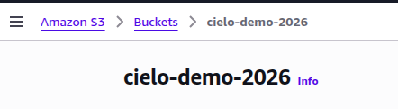
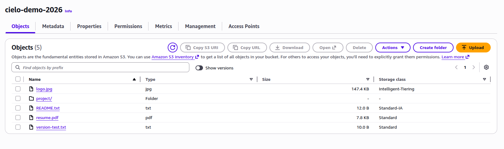
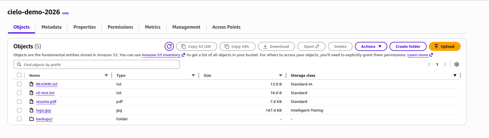
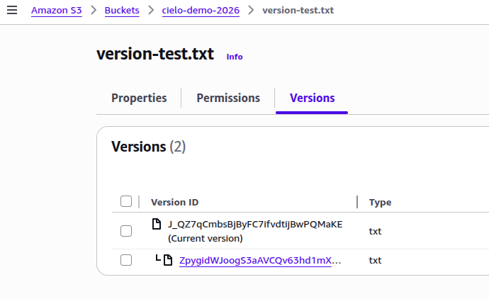
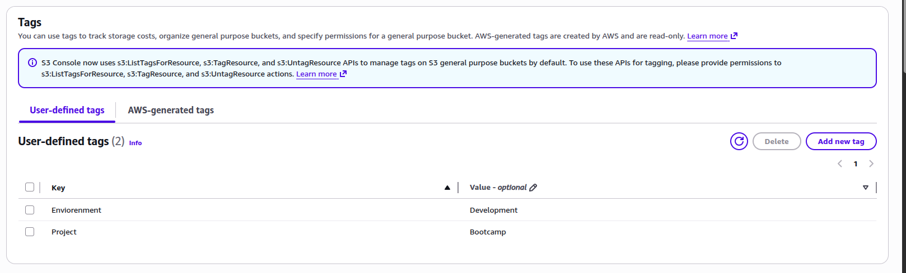
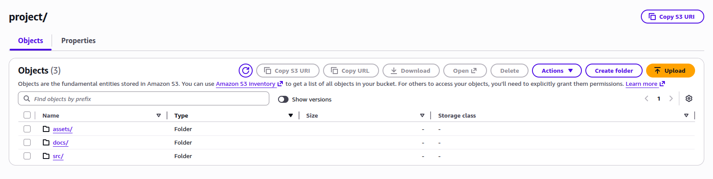

# Create S3 Bucket Lab - Solution

**Student Name:** Cielo Escobar  
**Date:** 2026  

---

## Exercise 1: Bucket Creation

**Bucket Name:** cielo-demo-2026  
**Region:** eu-central-1  

---

## Exercise 2: Object Uploads

### Files Uploaded:
Total objects uploaded: 5

- README.txt (text file)
- resume.pdf (document)
- logo.jpg (image)
- cli-test.txt (CLI upload)
- version-test.txt (versioning test)

### Folder Structure:

**Folders Created:**
- images/
- documents/
- backups/

---

## Exercise 3: Storage Classes

**Storage Classes Used:**
- Standard
- Standard-IA
- Intelligent-Tiering

---

## Exercise 4: Bucket Features

### Versioning:

**Number of versions created:** 2

### Encryption:

**Encryption type:** SSE-S3

### Tags:

**Tags Added:**
- Environment: Development
- Project: Bootcamp

---

## Exercise 5: Download/Delete

**Operations Completed:**
- Downloaded object via CLI
- Deleted object via CLI
- Deleted folder via CLI

---

## Exercise 6: Sync Operations

**Sync actions performed:**
- Synced local directory to S3 bucket
- Verified uploaded files
- Re-synced after modifying a file

---

## Exercise 7: Metrics

---

## CLI Outputs

### CLI Operations Performed:

- Uploaded files using `aws s3 cp`
- Listed bucket contents using `aws s3 ls`
- Downloaded objects from S3
- Deleted objects and folders
- Synced local directory using `aws s3 sync`

All detailed command outputs are available in `cli-outputs.txt`.